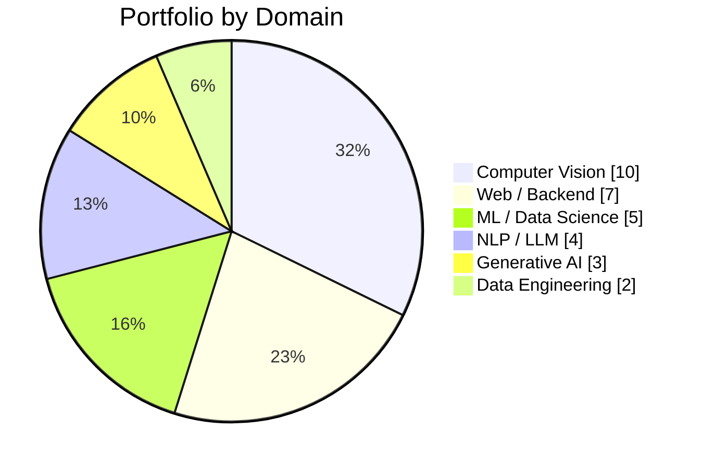

<div align="center">

# Danish Javed

**AI / ML Engineer · NLP & Computer Vision · Based in Germany**

[](https://github.com/danishjavedcodes)
[](https://ieeexplore.ieee.org/document/10935058)
[](https://github.com/danishjavedcodes)

</div>

---

## 👋 Introduction

I am an **AI / Machine Learning practitioner** based in **Passau, Germany**, with hands-on experience across **Natural Language Processing (NLP)**, **Deep Learning**, **Computer Vision**, and **applied LLM systems**.

My work spans **research-grade NLP** (published at IEEE ICET 2024), **transformer-based knowledge extraction**, **object detection pipelines (YOLO / R-CNN)**, and **production-oriented prototypes** including RAG-style chatbots and web-scraping data pipelines.

I am actively seeking **Werkstudent** positions as an **AI/ML Engineer** in the **German tech market**.

---

## 🧠 Core Skills

| Area | Competencies |
|------|----------------|
| **Machine Learning** | Supervised learning, model training & evaluation, classical ML (Naive Bayes, Decision Trees) |
| **Deep Learning** | CNNs, BiLSTM, GANs, Transfer Learning, fine-tuning |
| **NLP / NLU** | Text classification, extractive summarization, NER, Knowledge Graphs, financial text structuring |
| **LLMs & GenAI** | BERT / RoBERTa, OpenAI API, prompt-based generation, hybrid retrieval + generation chatbots |
| **Generative AI** | LoRA fine-tuning (visuals), ComfyUI workflows, Stable Diffusion, GANs, REST API inference pipelines |
| **Computer Vision** | Object detection (YOLO, R-CNN), face detection (OpenCV), medical imaging (CNN) |
| **Data Engineering** | Web scraping (Scrapy), dataset construction, preprocessing pipelines |
| **Research** | Custom dataset design, ROUGE evaluation, reproducible experiments, technical documentation |

**Keywords (ATS / German job market):**  
`Python` · `PyTorch` · `Deep Learning` · `Machine Learning` · `Generative AI` · `LoRA` · `ComfyUI` · `Stable Diffusion` · `NLP` · `NLU` · `Computer Vision` · `Transformers` · `BERT` · `Hugging Face` · `LLM` · `RAG` · `REST API` · `FastAPI` · `YOLO` · `CNN` · `GAN` · `scikit-learn` · `pandas` · `NumPy` · `OpenCV` · `Jupyter` · `Model Evaluation`

---

## ⚙️ Tech Stack

```text
Languages       Python · C++ · HTML/CSS
ML / DL         PyTorch · scikit-learn · Ultralytics YOLO · OpenCV
NLP             Transformers · BERT · RoBERTa · NLTK · spaCy
LLM / APIs      OpenAI GPT-3.5 · Hugging Face ecosystem
Generative AI   LoRA fine-tuning · ComfyUI · Stable Diffusion · GANs · visual generation
CV              CNN · R-CNN · YOLO · Haar Cascades
Data & Tools    pandas · NumPy · Matplotlib · Scrapy · Jupyter
Web / Backend   Flask · FastAPI · REST APIs (inference & serving)
Dev Practices   Git · reproducible notebooks · structured project layouts
```

---

## 🚀 Featured Projects

### 🔬 Research & NLP

| Project | Description | Stack |
|---------|-------------|-------|
| [**urdu-text-summarization**](https://github.com/danishjavedcodes/urdu-text-summarization) | **IEEE ICET 2024** — Extractive Urdu summarization with custom **UCES-v1** dataset; BiLSTM vs. customized **BERT**; **ROUGE** evaluation | PyTorch, BERT, BiLSTM, NLP |
| [**Knowledge-Graph-Construction-for-Pollution-Regulation**](https://github.com/danishjavedcodes/Knowledge-Graph-Construction-for-Pollution-Regulation) | Entity & relation extraction from regulatory PDFs; **Knowledge Graph** construction with fine-tuned **RoBERTa** | PyTorch, Transformers, spaCy, NER |
| [**Transforming-Unstructured-Financial-Text-into-Comprehensive-Tables**](https://github.com/danishjavedcodes/Transforming-Unstructured-Financial-Text-into-Comprehensive-Tables) | NLP pipeline to structure unstructured financial text into tabular data | Python, NLP |
| [**AIchatbot**](https://github.com/danishjavedcodes/AIchatbot) | Hybrid **LLM chatbot** — predefined knowledge base + **OpenAI GPT-3.5** for open-domain queries | OpenAI API, Python, Jupyter |

### 👁️ Computer Vision

| Project | Description | Stack |
|---------|-------------|-------|
| [**UAVYOLO**](https://github.com/danishjavedcodes/UAVYOLO) | **YOLO** training & evaluation pipeline for aerial / UAV object detection | PyTorch, Ultralytics, OpenCV |
| [**RCNN-for-object-detection**](https://github.com/danishjavedcodes/RCNN-for-object-detection) | **R-CNN**-based cat/dog detection with training notebooks | PyTorch, CV |
| [**CNN_model_for_Bone_Fracture_detection**](https://github.com/danishjavedcodes/CNN_model_for_Bone_Fracture_detection) | **CNN** for medical **bone fracture** classification | Jupyter, CNN, Medical Imaging |
| [**ColorizingSketches**](https://github.com/danishjavedcodes/ColorizingSketches) | Sketch-to-color generation using **GANs** (Pokémon dataset) | GAN, Deep Learning |
| [**Face-Detection**](https://github.com/danishjavedcodes/Face-Detection) | Real-time face detection with **OpenCV** Haar Cascades | Python, OpenCV |
| [**ActiveLife**](https://github.com/danishjavedcodes/ActiveLife) | **AI-powered** motion controller — camera-based pose/actions for endless-runner games | Computer Vision, HCI |

### 📊 Classical ML & Data

| Project | Description | Stack |
|---------|-------------|-------|
| [**Ml_models_to_Predict_Spam_Email**](https://github.com/danishjavedcodes/Ml_models_to_Predict_Spam_Email) | Email spam/ham classification (**Gaussian NB**, **Multinomial NB**, **J48**) | scikit-learn, Jupyter |
| [**Hybrid-Approach-for-Skin-types-Classification**](https://github.com/danishjavedcodes/Hybrid-Approach-for-Skin-types-Classification) | Hybrid model for dermatological skin-type classification | ML, Jupyter |
| [**Scraping-Degree-Programs**](https://github.com/danishjavedcodes/Scraping-Degree-Programs) | **Scrapy** crawler for structured master's program data (MastersPortal) | Python, Scrapy, JSON ETL |

---

## 📊 Language Distribution

<div align="center">

<!-- Donut: share of code by language across all repos -->


<!-- Bar: repos count per primary language -->


</div>

| Primary Language | Repositories | Typical Use |
|------------------|:------------:|-------------|
| Jupyter Notebook | 14 | ML experiments, model training, evaluation |
| Python | 9 | NLP pipelines, CV, Scrapy, APIs |
| HTML / CSS | 5 | Web apps & semester projects |
| C++ / TeX | 2 | Systems & research documentation |

---

## 🧩 Project Stack Overview

*How your portfolio breaks down by domain and technology.*

### Domain Focus



### Technology Stack (from repositories)

<div align="center">


</div>

| Stack Layer | Technologies | Example Projects |
|-------------|--------------|------------------|
| **Deep Learning** | PyTorch, BERT, BiLSTM, CNN | `urdu-text-summarization`, `CNN_model_for_Bone_Fracture_detection` |
| **Generative AI** | **LoRA** fine-tuning (visual models), **ComfyUI** pipelines & node workflows, Stable Diffusion / diffusion models, GANs, image & video generation, **REST APIs** (inference & serving) | `ColorizingSketches`, `FashionGAN`, `Yolo-Deployment` |
| **NLP / LLM** | Transformers, RoBERTa, OpenAI API, spaCy, prompt engineering | `Knowledge-Graph-Construction-for-Pollution-Regulation`, `AIchatbot` |
| **Computer Vision** | YOLO, Ultralytics, R-CNN, OpenCV | `UAVYOLO`, `RCNN-for-object-detection`, `Face-Detection` |
| **Classical ML** | scikit-learn, pandas, NumPy | `Ml_models_to_Predict_Spam_Email`, `Hybrid-Approach-for-Skin-types-Classification` |
| **Data Engineering** | Scrapy, JSON ETL, pandas | `Scraping-Degree-Programs`, `Data-Pack` |
| **Web / APIs** | Flask, FastAPI, HTML/CSS, REST endpoints | `CS-232-Semester-Project`, `gikeats.github.io`, `AIchatbot` |

### Stack Distribution

```text
Generative AI      ██████░░░░░░░░░░░░░░  3 repos   (9%)   LoRA · ComfyUI · REST APIs
Computer Vision    ████████████████████░ 10 repos  (29%)
NLP / LLM          ████████░░░░░░░░░░░░  4 repos   (11%)
ML / Data Science  ██████████░░░░░░░░░░  5 repos   (14%)
Web / Backend      ██████████████░░░░░░  7 repos   (20%)
Data Engineering   ████░░░░░░░░░░░░░░░░  2 repos   (6%)
Other / Tools      ████████████░░░░░░░░ 11 repos  (31%)
```

> Charts reflect public repositories only.

---

## 📫 Contact & Links

<div align="center">

[](https://github.com/danishjavedcodes)
[](https://www.linkedin.com/in/YOUR-LINKEDIN-USERNAME)
[](https://danishjavedcodes.github.io)
[](mailto:YOUR.EMAIL@example.com)

</div>

> 💡 **Open to collaboration** on NLP, LLM applications, generative AI (LoRA / ComfyUI), and computer-vision projects.  
> 🇩🇪 Standort: **Deutschland** · Sprachen: **Deutsch** & **Englisch**

---

<div align="center">

*Building intelligent systems — from research papers to deployable ML prototypes.*

</div>
